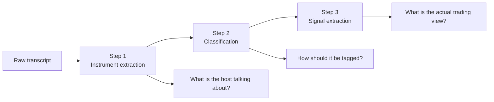

# Who Is a Real Market Guru?

<p align="center">
  
</p>

<p align="center">
  <strong>A transcript intelligence pipeline for separating market storytelling from real, auditable trading views.</strong>
</p>

<p align="center">
  Built for long-form finance videos with Mandarin speech, slang, ASR noise, broad macro references, and hosts who rarely say "buy" or "sell" directly.
</p>

## The idea

The internet is full of market commentators.

Some are thoughtful.
Some are lucky.
Some sound convincing but never really make a falsifiable call.

This project is built around one simple question:

> **Can we turn financial video transcripts into structured evidence, so we can compare what a guru actually said, what they meant, and what trading view they implied?**

That is the purpose of this repo.

Not just transcript parsing.
Not just sentiment.

But a system that tries to answer:

- what target the host is talking about
- how that target should be normalized and tagged
- whether the host is truly bullish, bearish, defensive, contradictory, or just vague

## Why this is different

Most demos jump directly from raw transcript to final label.

This repo deliberately **does not**.

It splits the reasoning into three stages:

1. **Instrument extraction**
2. **Classification**
3. **Signal extraction**

That separation matters because early mistakes are expensive.

If a noisy ASR phrase is wrongly normalized into the wrong benchmark, every downstream signal becomes misleading.

This workflow is designed to stop that error cascade.

## The three-step pipeline



## What this project can reveal

Once a transcript is converted into structured outputs, we can start asking much more interesting questions:

- Does a guru mostly talk in vague narratives, or in actionable views?
- Do they keep changing targets mid-sentence?
- Are they bullish in story, but defensive in actual signal?
- Do they constantly hide behind broad phrases like “watch it carefully” without committing?
- Are they consistently early, consistently late, or consistently non-committal?

This is the foundation for a **battle of gurus** style evaluation system.

## Example output

The figure below is generated from actual processed transcript output in this repo:

<p align="center">
  
</p>

It shows the most common tagged targets found across processed dates, including:

- `fx_usd`
- `equity_benchmark_USA`
- `equity_caplarge_USA`
- `cmd_gold`
- `cmd_oil`
- `equity_benchmark_CHN`

This is already more than a toy extraction demo.
It is a structured market-language dataset in progress.

## Interactive charts

Static images are great for a quick first impression. Here are hosted snapshots of the monthly classification charts:

- [2020 chart](https://i.imgur.com/11apqU5.png)
- [2021 chart](https://i.imgur.com/F2rmTC7.png)
- [2022 chart](https://i.imgur.com/Ar8VSfW.png)
- [2023 chart](https://i.imgur.com/u532ISe.png)
- [2024 chart](https://i.imgur.com/vMT3Pni.png)
- [2025 chart](https://i.imgur.com/UcwNLJp.png)
- [2026 chart](https://i.imgur.com/WHEo0fR.png)

## Benchmark channels

These are good examples of the kind of public market commentary this pipeline is designed to analyze.

They are included here as **benchmark case studies**, not as accusations or verdicts.

- [Spark Liang 张开亮](https://www.youtube.com/channel/UCxoBFF9T94U8KLu2E3NwaLA)
- [Better Leaf 好葉](https://www.youtube.com/channel/UChjHWpmNm-3HbLFkQ3TPXaA)
- [楊世光在金錢爆（金錢爆）](https://www.youtube.com/@57watcher)
- [向陽說](https://www.youtube.com/@%E5%90%91%E9%99%BD%E8%AA%AA)

The longer-term vision is to compare creators not by charisma, but by:

- clarity of targets
- consistency of views
- frequency of real directional calls
- willingness to be specific
- signal quality over time

## What each step does

| Step | Question | Output | Why it matters |
| --- | --- | --- | --- |
| Step 1 | What did the host actually mean? | `instrument` + `instrument_normalized` | Handles ASR noise and prevents over-normalization |
| Step 2 | How should that target be represented? | tags like `equity_benchmark_USA`, `gov_2Y`, `cmd_soybean`, `fx_basket` | Creates a stable machine-readable taxonomy |
| Step 3 | What is the host's real trading intent? | `open_buy`, `open_sell`, `close_buy`, `close_sell`, `duplicate`, `invalid`, `unclear` | Distinguishes real signals from vague talk |

## Why the design is interesting

- **Full-context extraction**
  - Step 1 reads the full transcript before deciding what a mention means.

- **Alias-aware classification**
  - Step 2 uses `instrument_normalized` as the main anchor and transcript aliases as support.

- **ASR-aware reasoning**
  - The workflow explicitly handles slang, homophones, and noisy transcript fragments.

- **Target-first signal extraction**
  - Step 3 judges the host's view on the normalized target, not just whichever wording happened to appear.

- **Tactical vs directional distinction**
  - “Don’t chase” is different from “sell”.
  - “Wait for pullback” is different from “short it”.
  - The schema models that difference explicitly.

- **Inspectable intermediate layers**
  - Instruments, taxonomy tags, helper items, and signals remain visible and debuggable.

## A concrete example

If a host says something like:

- “long term I still like China equities”
- “but right now keep cash high”
- “don’t chase”
- “look for short opportunities”

a weak system might simply call that “bullish”.

This repo tries to do something more honest:

- preserve the discussed target
- classify it consistently
- distinguish long-term narrative from current tactical instruction

That is the kind of nuance needed to judge whether a commentator is truly useful.

## Repository map

### Main entry points

- `main/extract_instrument.py`
  - Step 1 instrument extraction
- `main/extract_classification.py`
  - Step 2 taxonomy classification
- `main/visualize.py`
  - charts and output visualization

### Core logic

- `template/template_20260424_2026.py`
  - extraction schema
  - classification schema
  - signal schema
- `src/mq_tag_summary.py`
  - summary loading and tag aggregation
- `src/openai_api.py`
  - batch LLM execution wrapper

### Workflow notes

- `WORKFLOW.md`
  - detailed explanation of Step 1 / Step 2 / Step 3 responsibilities

## Running the current pipeline

Put transcript files under `transcript2/`, then run:

```bash
python main/extract_instrument.py
python main/extract_classification.py
python main/visualize.py
```

The main schemas currently live in:

```text
template/template_20260424_2026.py
```

## What this could become

This repo is still a research workflow, but it is already heading toward something much bigger:

- transcript-backed guru comparison
- auditable call extraction
- creator-level consistency scoring
- “battle of gurus” leaderboards
- market commentary quality evaluation

In other words:

**less worship of confidence, more measurement of clarity and signal quality.**

## Why this is worth attention

Many AI projects are polished wrappers around generic prompting.

This one is trying to solve a messier and more interesting problem:

> **How do you turn noisy financial speech into structured, reviewable, and eventually rankable market intelligence?**

That is why this repo focuses on:

- full-context reasoning
- explicit intermediate states
- taxonomy discipline
- ASR-aware normalization
- signal extraction that separates
  - bullish vs bearish
  - tactical caution vs directional conviction
  - duplicate interpretations vs genuine signals

If the goal is to identify who is actually insightful, and who only sounds insightful, this is the right direction.
